<div dir="rtl">

# خريطة رحلات بولس الرسول

**Note:** This is a vibe-coded app with Claude

خريطة عربية تفاعلية لمدن رحلات بولس الرسول ورسائله، مرسومة فوق خريطة Mapbox بأسلوب البكسل.
صُمّم التطبيق للعرض على شاشة القاعة في **إعداد خدام ٢٠٢٦**: يقف الخادم أمام الشاشة ويتنقّل
بين المشاهد ضغطةً ضغطة، والخريطة تتحرك بالكاميرا والخطوط والعلامات لتخدم الشرح.

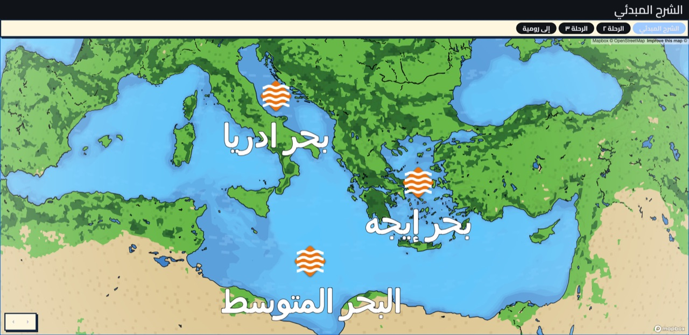

## ما الذي يعرضه التطبيق؟

شاشة واحدة، وخريطة واحدة، وأربعة «سيناريوهات» تتبدّل عليها بالأزرار أعلى الشاشة (أو بمفاتيح
الأرقام ١–٤):

| الزر          | السيناريو                    | ما يحدث                                                                            |
| ------------- | ---------------------------- | ---------------------------------------------------------------------------------- |
| الشرح المبدئي | **الخريطة الصليبية**         | جولة في المصطلحات الجغرافية للرسائل: قارات، بلاد، بحار، جزر، ثم مدن الرسائل        |
| الرحلة ٢      | **الرحلة التبشيرية الثانية** | من أنطاكية إلى كورنثوس، ورسالة تُرسَل إلى تسالونيكي                                |
| الرحلة ٣      | **الرحلة التبشيرية الثالثة** | من أنطاكية إلى أفسس (رسالتان إلى غلاطية وكورنثوس)، ثم إلى كورنثوس ورسالة إلى رومية |
| إلى رومية     | **الرحلة إلى رومية**         | من قيصرية إلى رومية بحرًا عبر مالطة، ثم رسائل السجن إلى فيلبي وكولوسي وأفسس        |

### ١. الشرح المبدئي — الخريطة الصليبية

أربع فئات مرتّبة على شكل صليب متساوي الأذرع فوق البحر المتوسط: **قارات** في الأعلى، **بلاد** في
الأسفل، **بحار** على اليسار، **جزر** على اليمين. وهي أداة للحفظ لا خط سير: كل ضغطة «التالي»
تفتح فئة وتُقرّب الكاميرا على عناصرها، ثم تعود إلى الصليب كاملًا حتى تُقرأ كل ذراع في سياق الكل،
وتُختَم الجولة بمدن الرسائل داخل البلاد الثلاثة.

| القارات                                        | البلاد                                       |
| ---------------------------------------------- | -------------------------------------------- |
| 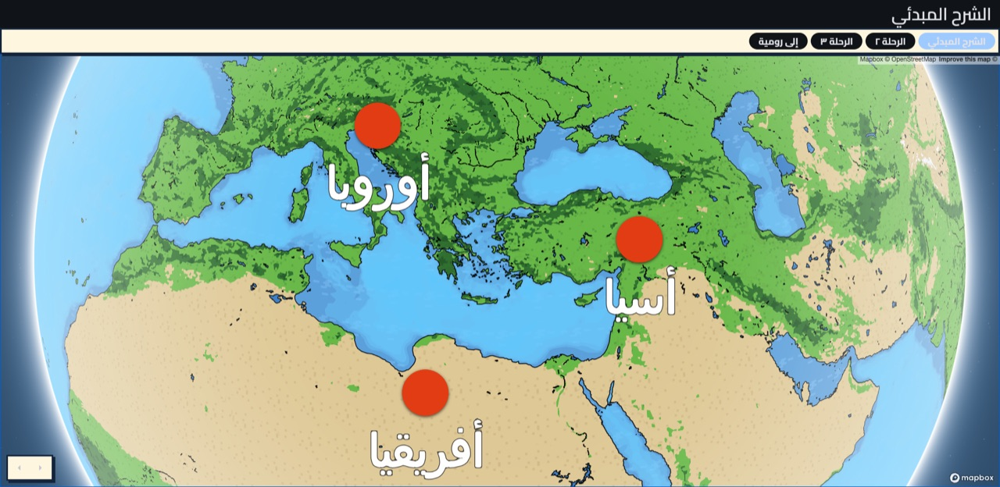 | 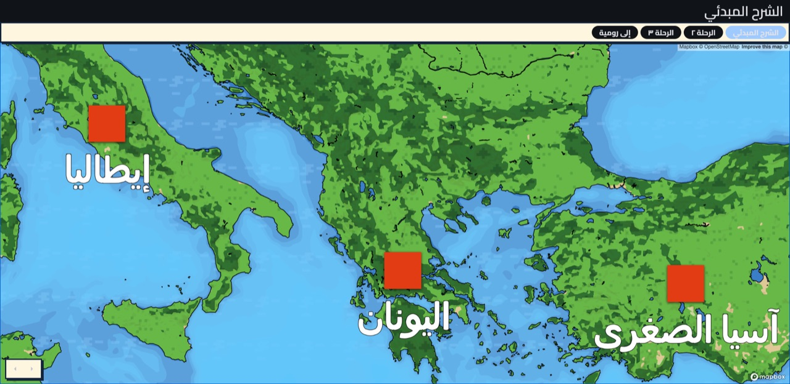 |

| البحار                                  | الجزر                                     |
| --------------------------------------- | ----------------------------------------- |
| 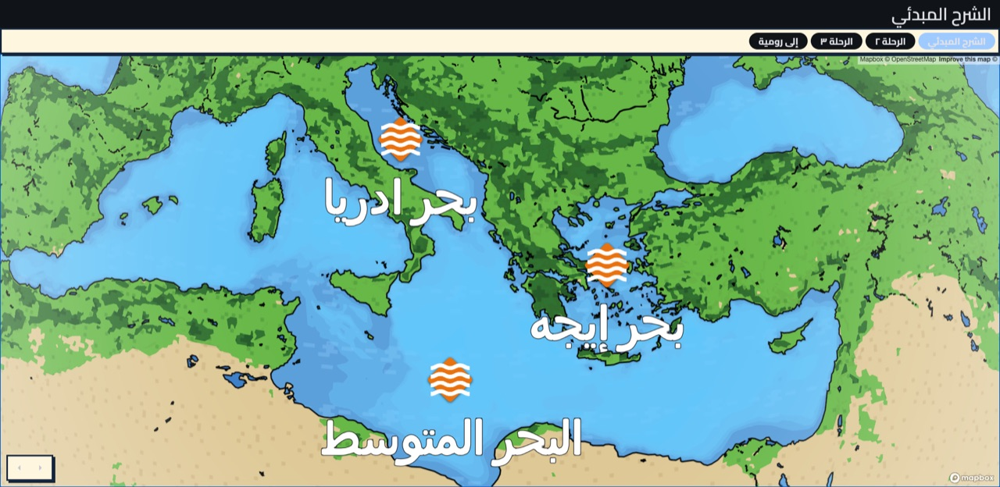 | 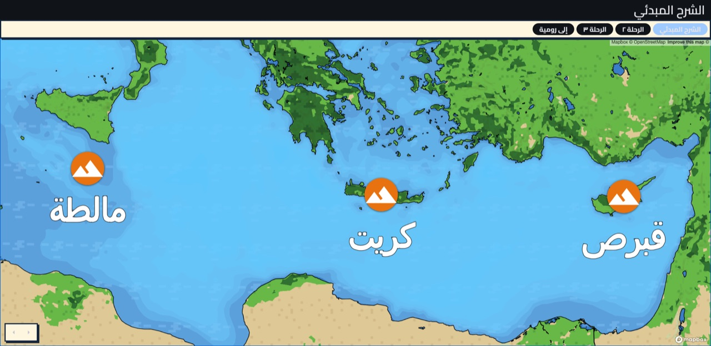 |

ثم مدن كل بلد على حدة — آسيا الصغرى (غلاطية، أفسس، كولوسي)، اليونان (فيلبي، تسالونيكي،
كورنثوس)، إيطاليا (رومية):

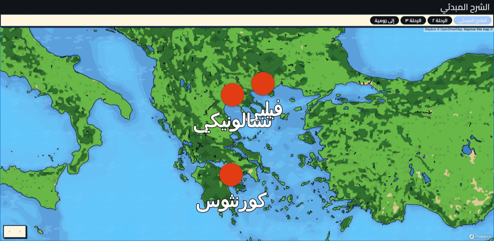

الترتيب كاملًا موجود في [`st_paul_map_dataset.dart`](lib/src/data/st_paul_map_dataset.dart)،
والشجرة المختصرة في [`overview.md`](overview.md).

### ٢ و٣ و٤. الرحلات التاريخية

كل رحلة تبدأ بلقطة على نقطة الانطلاق، ثم مع كل ضغطة يُرسَم خط الرحلة على الخريطة ببطء، وتظهر
المدن الكبرى حين يصل إليها الخط، وتُضاء «منارة» عند كل مدينة أُرسلت إليها رسالة من هذه المحطة —
منارة واحدة مع كل ضغطة.

| بداية الرحلة الثانية (أنطاكية)                                        | الوصول إلى كورنثوس ورسالة إلى تسالونيكي                   |
| --------------------------------------------------------------------- | --------------------------------------------------------- |
| 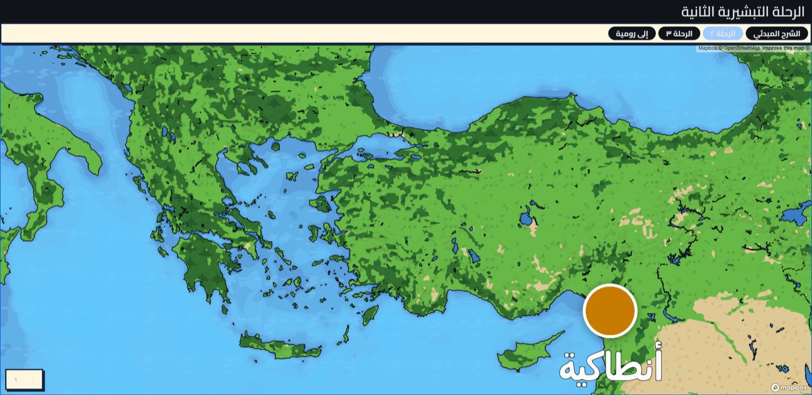 | 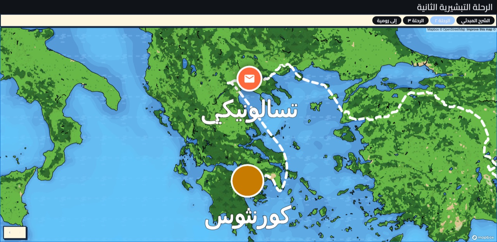 |

| الرحلة الثالثة: في أفسس ورسالة إلى غلاطية                        | الرحلة الثالثة: في كورنثوس ورسالة إلى رومية                        |
| ---------------------------------------------------------------- | ------------------------------------------------------------------ |
| 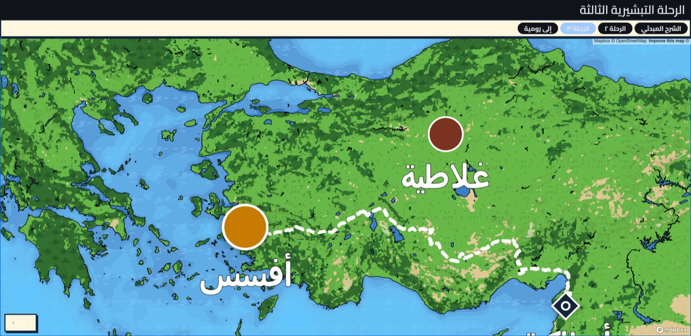 | 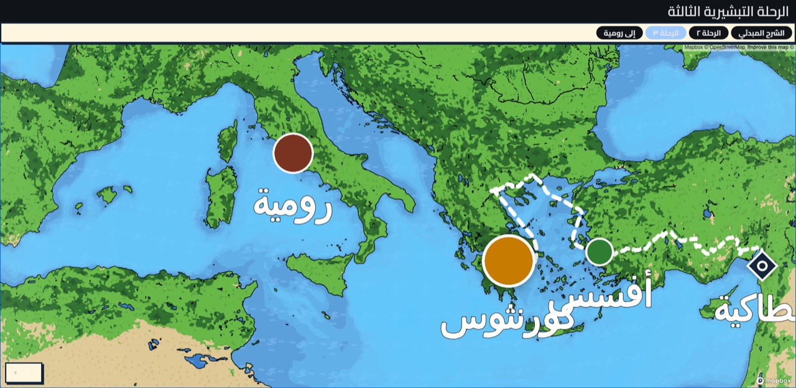 |

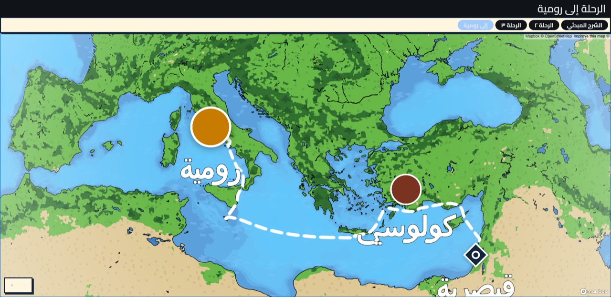

## التحكّم أثناء العرض

التطبيق مبني للتقديم بلوحة المفاتيح أو بمقدّم عروض (clicker)، والأسهم على الشاشة أسفل اليسار
للاحتياط.

| المفتاح                          | الفعل                                                          |
| -------------------------------- | -------------------------------------------------------------- |
| `←` أو `مسافة` أو `Enter` أو `↓` | الخطوة التالية                                                 |
| `→` أو `Backspace` أو `↑`        | الخطوة السابقة                                                 |
| `1` `2` `3` `4`                  | اختيار السيناريو: الشرح المبدئي، الرحلة ٢، الرحلة ٣، إلى رومية |
| `.` أو `b`                       | إطفاء الشاشة (سواد كامل) والعودة                               |
| `f`                              | تشغيل/إيقاف وميض المنارات                                      |

أثناء تحريك الكاميرا أو رسم الخط، تُحفَظ الضغطات في طابور وتُنفَّذ بالترتيب بعد انتهاء الحركة،
فلا تضيع ضغطة ولا تتداخل حركتان.

## التشغيل

### ١. مفتاح الوصول (كل المنصات)

الخريطة تحتاج مفتاح Mapbox **عام** (`pk.…`). لا يُحفَظ في المستودع أبدًا، ويُمرَّر وقت البناء:

<div dir="ltr">

```sh
flutter run --dart-define=MAPBOX_ACCESS_TOKEN=pk.your_token_here
```

</div>

نفس الخيار مع `flutter build`. بدونه يعمل التطبيق لكنه يعرض تنبيه «مفتاح الوصول مفقود» مكان
الخريطة بدلًا من شاشة فارغة.

### ٢. مفتاح تحميل الـ SDK (android و ios فقط)

الـ Mapbox Maps SDK يُقدَّم من سجلّ Maven/CocoaPods خاص يحتاج مفتاحًا **سرّيًا** (`sk.…`) بصلاحية
`DOWNLOADS:READ` — يُنشأ من <https://console.mapbox.com/account/access-tokens/>. إعداد يُجرى مرة
واحدة على الجهاز وليس جزءًا من المستودع:

<div dir="ltr">

```sh
# Android
echo "SDK_REGISTRY_TOKEN=sk.your_secret_token" >> ~/.gradle/gradle.properties

# iOS
printf 'machine api.mapbox.com\n  login mapbox\n  password sk.your_secret_token\n' >> ~/.netrc
chmod 600 ~/.netrc
```

</div>

الويب لا يحتاج شيئًا من هذا: يُحمَّل Mapbox GL JS من وسم `<script>` في `web/index.html`.

### للعرض على الويب

<div dir="ltr">

```sh
flutter build web --release --dart-define=MAPBOX_ACCESS_TOKEN=pk.your_token_here
python3 -m http.server 8080 --directory build/web
```

</div>

ثم افتح `http://localhost:8080` في المتصفح بملء الشاشة.

## كيف تُبنى الخريطة

| الطبقة                                                        | المكان                                                                                                                  |
| ------------------------------------------------------------- | ----------------------------------------------------------------------------------------------------------------------- |
| وصفة البكسل (اللوحة اللونية، الرسومات، إعادة كتابة الـ style) | [lib/src/map_engine/pixel_style/](lib/src/map_engine/pixel_style/) — Dart خالص، مشترك بين المنصات                       |
| أهداف الكاميرا، العلامات، والخطوط                             | [lib/src/map_engine/](lib/src/map_engine/)                                                                              |
| المُصيِّر على android/ios                                     | [mapbox_map_surface_native.dart](lib/src/map_engine/mapbox/mapbox_map_surface_native.dart) — Mapbox Maps SDK            |
| المُصيِّر على الويب                                           | [mapbox_map_surface_web.dart](lib/src/map_engine/mapbox/mapbox_map_surface_web.dart) — Mapbox GL JS                     |
| بيانات الخريطة الصليبية والرحلات                              | [lib/src/data/](lib/src/data/)                                                                                          |
| السيناريوهات والتحكّم                                         | [lib/src/presentation/stage/](lib/src/presentation/stage/) و [lib/src/presentation/cubit/](lib/src/presentation/cubit/) |

شكل الخريطة يُعرَّف مرة واحدة في Dart ويُطبَّق على المُصيِّرَين كوثيقة style واحدة؛ انظر §10 من
مواصفات التصميم.

## التوثيق

- [`CONTEXT.md`](CONTEXT.md) — مصطلحات المجال (الخريطة الصليبية، الرحلة، المحطة، المنارة…) وهي المرجع
  المعتمد للتسمية في الكود.
- [`docs/design.md`](docs/design.md) — مواصفات التصميم المعتمدة (الإحداثيات، شكل العلامات،
  اللوحة اللونية، الخطوط، خريطة البكسل).
- [`docs/adr/`](docs/adr/) — سجلّ القرارات المعمارية.

## التحقق

<div dir="ltr">

```sh
dart analyze --plugins
flutter test
```

</div>

يجب تشغيل `dart analyze` مع `--plugins` ومن جذر المشروع بلا مسارات، وإلا تُهمَل تشخيصات
`solid_lints` بصمت. التفاصيل في [`docs/agents/linting.md`](docs/agents/linting.md).

</div>
